## Remaining Bugs
- Gitpod is working properly when sending the email and listing totals but for some reason on the deployed site it is sending those as 0.
     -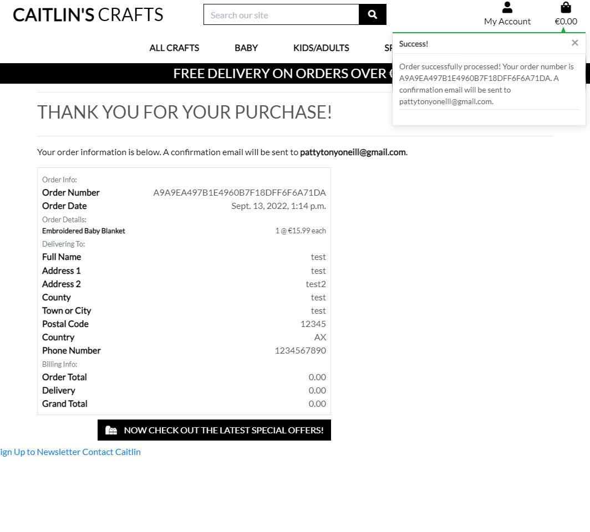
     -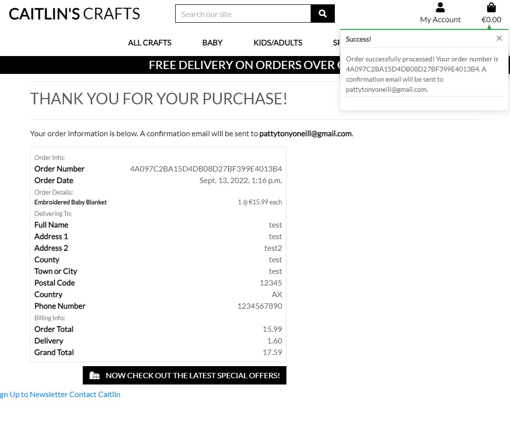this picture is after doing on heroku site and shows the error

## Bugs
- Needed to add I solve it by removing s from function in crafts/views.py. My function was not called craft_detail instead it was crafts_detail.
     -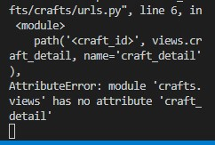
- Made crafts be craft where needed in code on crafts.html and craft_detail.html. 
     -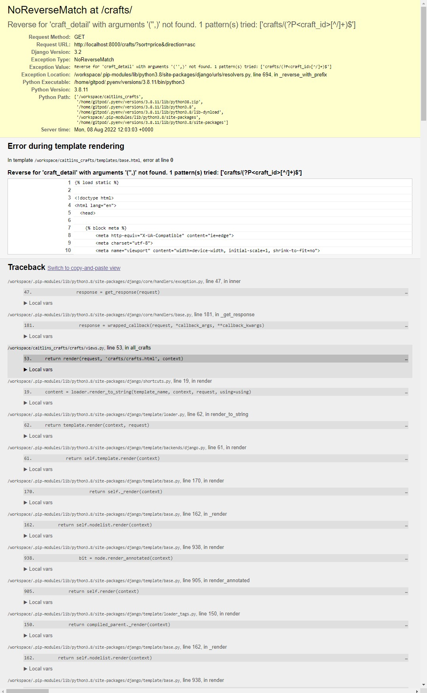
     -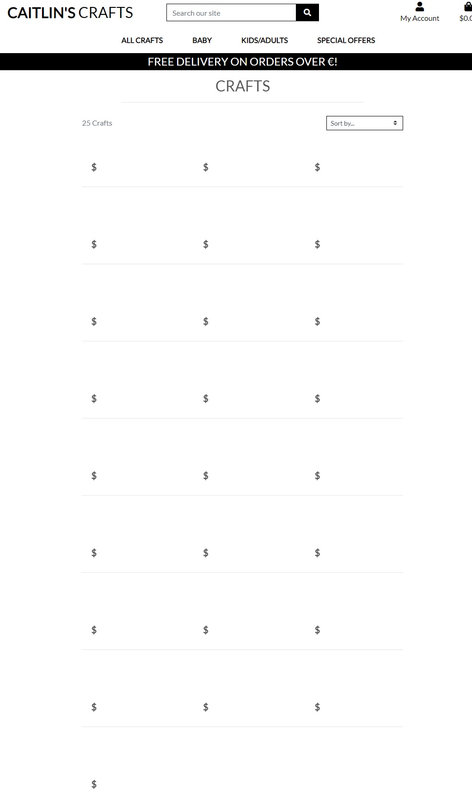
- Corrected stripe_element.js and changed it to stripe_elements.js
     -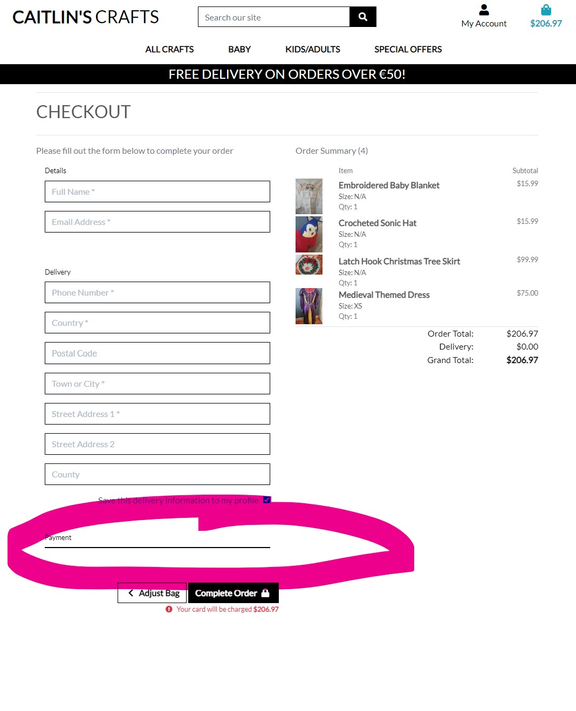
- Procfile I had put an empty row at the end and shouldn't have done so.
     -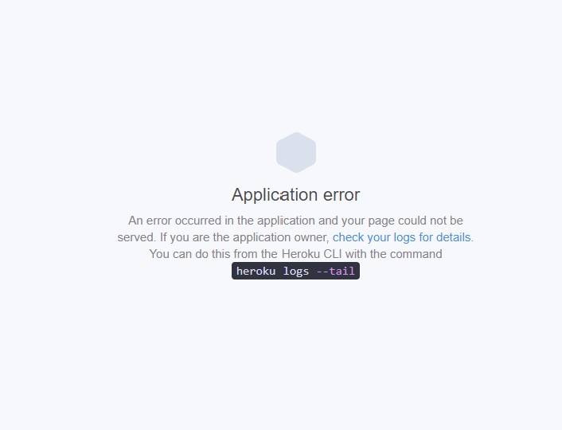
- Typo for allowed hosts. Found this after Procfile error.
     -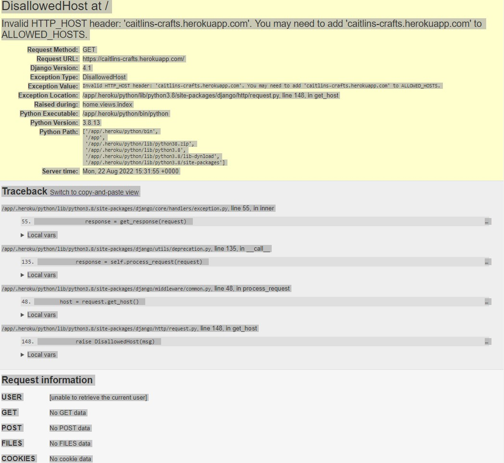
- Attribute Error at checkout. Added line of code that was missing.
     -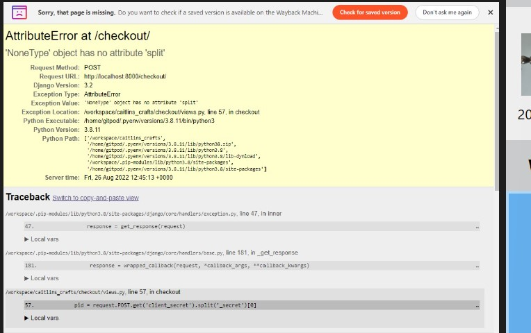
- Heroku had issue with pictures not coming up when entered on AWS. Come to find out when copying from zip file it was adding [1] after each photo number which I fixed by renaming before added to AWS again.
- webhooks had a 403 error under heroku because I forgot to add checkout/wh/
     -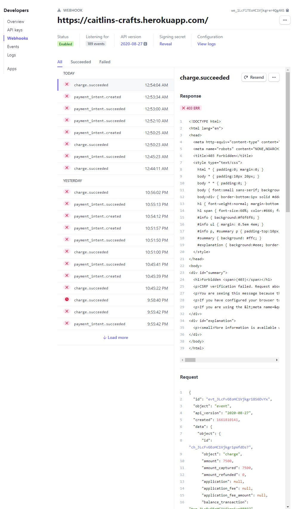
- webhooks had a 404 error under gitpod because I needed to make it public
     -
- ModuleNotFoundError: No module named'crafts.widgets'. I just had to stop and then restart my server.
     -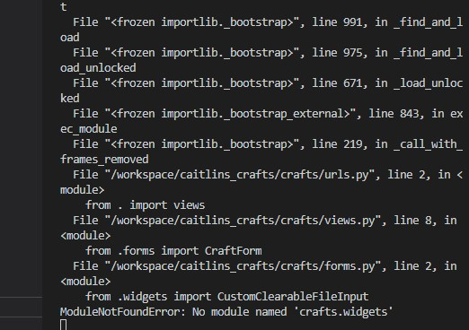
- Heroku 500error in the end redid creating the app on google
     -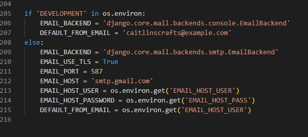
     -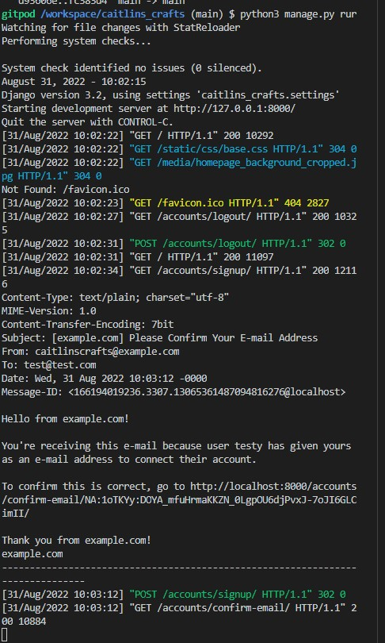
     -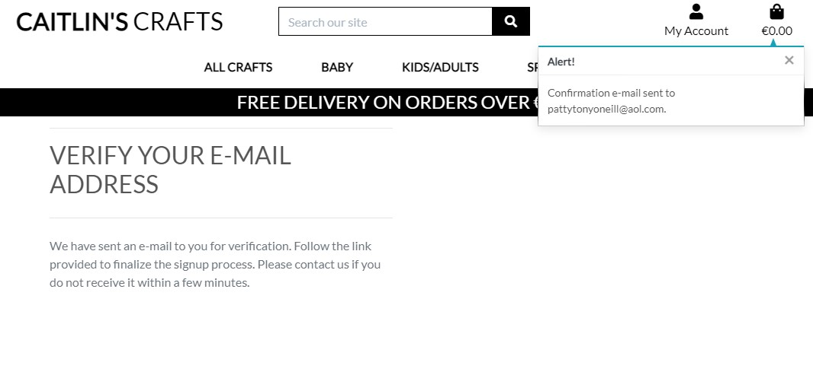
     -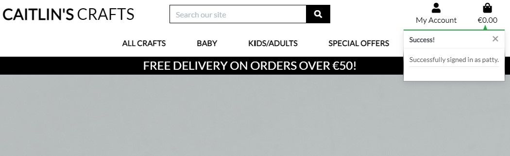
- Gitpod is working properly when sending the email and listing totals but for some reason on the deployed site it is sending those as 0.
     -
     -this picture is after doing on heroku site and shows the error

Return back to [TESTING.md](TESTING.md)
Return back to [README.md](README.md)