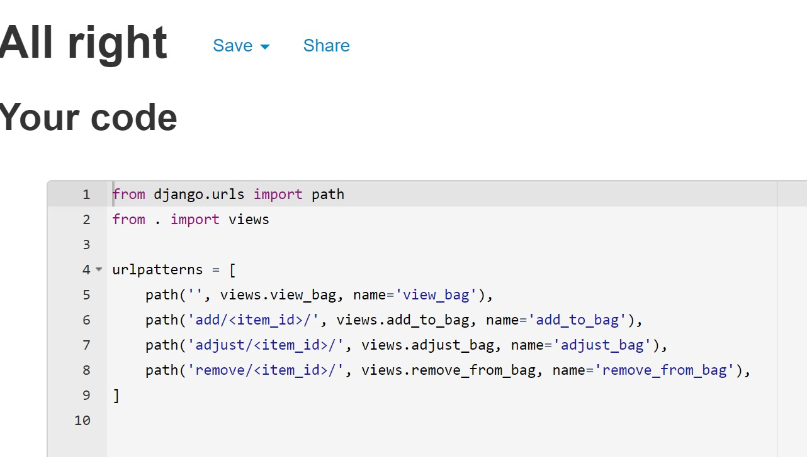
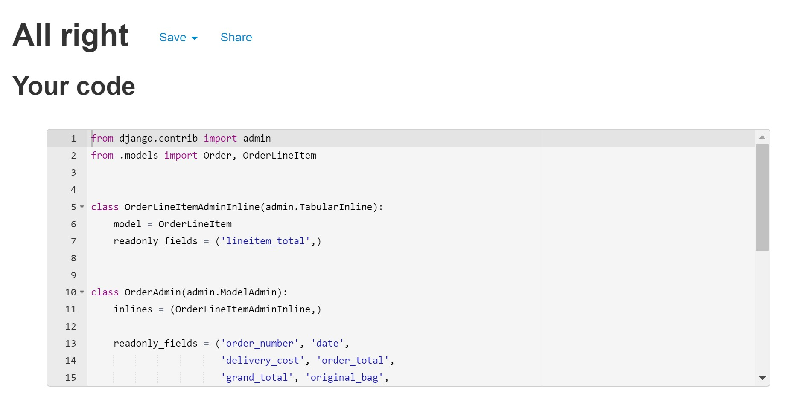

# Caitlin's Crafts
- 

### Pep8 Testing

## bag Pep 8
-  Pep8 for bag/apps.py
     - 
-  Pep8 for bag/contexts.py
     - 
-  Pep8 for bag/urls.py
     - 
-  Pep8 for bag/views.py
     - 

## caitlins_crafts Pep 8
-  Pep8 for caitlins_crafts/asgi.py
     - 
-  Pep8 for caitlins_crafts/settings.py
     - 
-  Pep8 for caitlins_crafts/urls.py
     - 
-  Pep8 for caitlins_crafts/wsgi.py
     - 

## checkout Pep 8
-  Pep8 for admin.py
     - 
-  Pep8 for apps.py
     - 
-  Pep8 for forms.py
     - 
-  Pep8 for models.py
     - 
-  Pep8 for signals.py
     - 
-  Pep8 for urls.py
     - 
-  Pep8 for urls.py
     - 
-  Pep8 for urls.py
     - 
-  Pep8 for urls.py
     -     

## contact Pep 8
-  Pep8 for models.py
     - 
-  Pep8 for models.py
     - 
-  Pep8 for models.py
     - 
-  Pep8 for models.py
     - 

## crafts Pep 8
-  Pep8 for models.py
     - 
-  Pep8 for models.py
     - 
-  Pep8 for models.py
     - 
-  Pep8 for models.py
     - 

## home Pep 8
-  Pep8 for models.py
     - 
-  Pep8 for models.py
     - 
-  Pep8 for models.py
     - 
-  Pep8 for models.py
     - 

## media Pep 8
-  Pep8 for models.py
     - 
-  Pep8 for models.py
     - 
-  Pep8 for models.py
     - 
-  Pep8 for models.py
     - 

## newsletter Pep 8
-  Pep8 for models.py
     - 
-  Pep8 for models.py
     - 
-  Pep8 for models.py
     - 
-  Pep8 for models.py
     - 

## profiles Pep 8
-  Pep8 for models.py
     - 
-  Pep8 for models.py
     - 
-  Pep8 for models.py
     - 
-  Pep8 for models.py
     - 

## custom_storage.py Pep 8
-  Pep8 for custom_storage.py
     - 

Return back to [TESTING.md](TESTING.md)
Return back to [README.md](README.md)