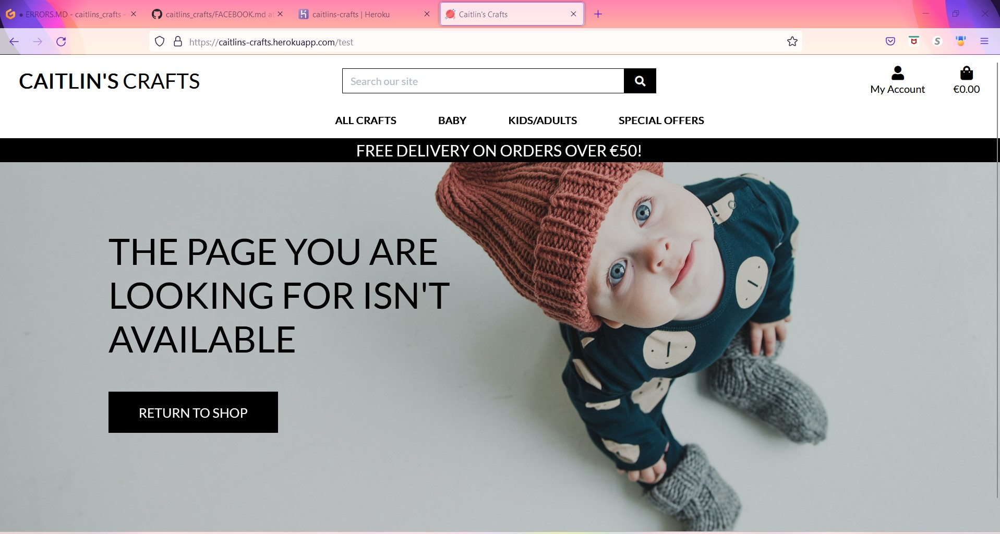

# Caitlin's Crafts
- 

## Visit the live Website : **[Caitlin's Crafts :arrow_right:](https://caitlins-crafts.herokuapp.com/)**
- Caitlin's Crafts is a website for users to find and purchase quality hand made items for themselves or for gifts.
- Users will be able to register for a newsletter on crafts available and any specials that are curently available.

## UX

For my wireframes, I have used [Balsamiq Wireframes](https://balsamiq.com/):
- Code Institute have provided all students with free access until the end of 2022.
- used due to the fact I can quickly and efficiently produce a wireframe.

### Wireframes

- My home page wireframe for this project can be found [here](wireframes/homepage.pdf).
- My bag wireframe for this project can be found [here](wireframes/bag.pdf).
- My checkout page wireframe for this project can be found [here](wireframes/checkout.pdf).
- My contact page wireframe for this project can be found [here](wireframes/contact.pdf).
- My crafts page wireframe for this project can be found [here](wireframes/crafts.pdf).
- My newsletter page wireframe for this project can be found [here](wireframes/newsletter.pdf).
- My profiles page wireframe for this project can be found [here](wireframes/profiles.pdf).
- My signin page wireframe for this project can be found [here](wireframes/signin.pdf).
- My signout page wireframe for this project can be found [here](wireframes/signout.pdf).
- My signup page wireframe for this project can be found [here](wireframes/signup.pdf).

## Existing Features
- Interactive Elements:
  - Home page
    - 
  - Login/Logout
    - 
    - 
  - Register
    - 
  - Choice of Crafts by Price, Category or All Crafts
    - 
  - Choice of Crafts from baby of blankets or accessories or All Baby
    - 
  - Choice of Crafts from Kids/Adults of clothes, hats, scarfs or All Kids/Adults
    - 
  - Choice of Crafts from Special Offers of Deals, Clearance or All Special Offers
    - 
  - Random Welcome message that changes on the home page
    - 
    - 
    - 
  - 404 Page for Caitlin's Crafts
    - 

## Languages Used:

- Python
- Django
- HTML
- CSS
- JavaScript

## Relational Database used:

- Postgres
- Dataschema
  - 

## Frameworks, Libraries & Programs Used:

- [Git](https://git-scm.com): used to utilize the Gitpod terminal to commit to Git and Push to GitHub
- [GitHub](https://github.com/): used to store project code after being pushed from Git
- [GitPod](https://gitpod.io/): used as cloud based IDE for writing code
- [Balsamiq Wireframes](https://balsamiq.com/):  used to draw wireframes of pages of project
- [Am I Responsive?](http://ami.responsivedesign.is/) used to give a visual of what the project looks like on various devices
- [Heroku](https://heroku.com): used to deploy the Our Family Recipes app
- [Diffchecker](https://www.diffchecker.com/): used to compare code when I had an error
- [Stripe](https://stripe.com/): used to add the ability to charge consumer for crafts purchased
- [Pexels](https://pexels.com/): used to obtain photo for home page
- [AWS](https://aws.amazon.com/): used for database of media used to be stored for heroku

## Deployment

The live deployed application can be found at [Caitlin's Crafts :arrow_right:](https://caitlins-crafts.herokuapp.com/+).

### Heroku Deployment

This project uses [Heroku](https://www.heroku.com), a platform as a service (PaaS) that enables developers to build, run, and operate applications entirely in the cloud.

Deployment steps are as follows, after account setup:

- Select *New* in the top-right corner of your Heroku Dashboard, and select *Create new app* from the dropdown menu.
- Your app name must be unique, and then choose a region closest to you (EU or USA), and finally, select *Create App*.
- From the new app *Settings*, click *Reveal Config Vars*, and set the following key/value pairs:
  - `DATABASE_URL` (this comes from the **Resources** tab, you can get your own Postgres Database using the Free Hobby Tier)
  - `SECRET_KEY` (this can be any random secret key)

Heroku needs two additional files in order to deploy properly.
- requirements.txt
- Procfile

You can install this project's requirements (where applicable) using: `pip3 install -r requirements.txt`. If you have your own packages that have been installed, then the requirements file needs updated using: `pip3 freeze --local > requirements.txt`

The Procfile can be created with the following command: `echo web: gunicorn family_recipes.wsgi > Procfile`

For Heroku deployment, follow these steps to connect your GitHub repository to the newly created app:

Either:
- Select "Automatic Deployment" from the Heroku app.

Or:
- In the Terminal/CLI, connect to Heroku using this command: `heroku login -i`
- Set the remote for Heroku: `heroku git:remote -a <app_name>` (replace app_name with your app, without the angle-brackets)
- After performing the standard Git `add`, `commit`, and `push` to GitHub, you can now type: `git push heroku main`

The frontend terminal should now be connected and deployed to Heroku.

### Local Deployment

*Gitpod* IDE was used to write the code for this project.

To make a local copy of this repository, you can clone the project by typing the follow into your IDE terminal:
- `git clone https://github.com/FamilyRecipes.git`

You can install this project's requirements (where applicable) using: `pip3 install -r requirements.txt`.

Alternatively, if using Gitpod, you can click below to create your own workspace using this repository.

## Creating AWS Bucket & Static/Media files

    - Go to AWS in the browser then log in or make an account.

    - Choose S3 in services.

    - Make a new S3 bucket for the site. Next create a static directory and media directory within the bucket.

    - After configuring the S3 bucket, copy the details into the settings.py file. - You will need the following: Storage Bucket Name, Storage Bucket Region Name, Access Key ID & Secret Access Key.

    - Configure the all of the above in your settings.py file.

    - In the env.py file created earlier, add the following:

    os.environ["AWS_ACCESS_KEY_ID"] = "copy in your access key" os.environ["AWS_SECRET_ACCESS_KEY"] = "copy in your secret access key"

    - In Heroku, add all of these keys to the config vars.

    - Next you add the key, DISABLE_COLLECTSTATIC with the value of 1 to the Heroku config vars, you must remembering to remove this before final deployment to heroku.

    - Add STATIC files settings in settings.py: configure url, storage path, directory path, root path, media url and default file storage path variables.

    - Link these files to the Templates directory inserting the snippet below (Place under the BASE_DIR line):

            TEMPLATES_DIR = os.path.join(BASE_DIR, 'templates')

                Change the templates directory to TEMPLATES_DIR (Place this in the TEMPLATES array):

                TEMPLATES = [
                {
                  …,
                  'DIRS': [TEMPLATES_DIR],
                  …,
                    ],
                  },
                },
                ]

    - Add Heroku Hostname to ALLOWED_HOSTS array: - ALLOWED_HOSTS = ['yourappname.herokuapp.com', 'localhost']

## Setting Up Media & Static Files
### GitPod:

    Create three new folders at top level directory: 'media', 'static' and 'templates'.
    Create PROCFILE at top level directory: - Procfile In Procfile:
    Add this code: - web: gunicorn PROJ_NAME.wsgi
    Save all your files. In the terminal:
    Add, Commit and Push: - git add . - git commit -m “Deployment Commit” - git push

In Heroku, navigate to the deployment tab and deploy the branch manually - watch the build logs for any errors. Heroku will now build the app. Once the build is finished, the live site will be deployed with a Heroku link provided and a success message.

## Stripe Setup

Caitlin's Crafts uses Stripe to handle all payments. A developer account was needed to gain access to the different API keys that will then be inputted into the env.py file and Heroku config vars. Keys included are STRIPE_PUBLIC_KEY, STRIPE_SECRET_KEY & STRIPE_WH_SECRET. These keys are then configured according to how Django requires as shown in their Stripe documentation.

## Future Additions to page
- Ratings for crafts that are on this site

## Credits
-  [Selling Crafts Online](https://wellkeptwallet.com/selling-crafts-online/)
-  [Design & Crafts Council Ireland](https://www.dcci.ie/about/media/press-releases/new-global-online-platform-launched-for-the-very-best-of-irelands-design-an)
-  [Design Ireland](https://www.designireland.ie/)
-  [Smart Touch](https://www.smarttouch.me/)
-  [The 6 Best Social Media Platforms for your Business 2022](https://www.lyfemarketing.com/blog/best-social-media-platforms/)

### Code
- _Readme used sample readme from code institute as a model. [Github](https://github.com/Code-Institute-Solutions/readme-template/blob/master/README.md)_

### Content
- _All content written by the developer._

### Acknowlegements
- _My Mentor for his help and feedback._
- _Tutor support at Code Institute_
- _Family for help with help and feedback on website as a user_
- _Caitlin my daughter for being the inspiration for this particular website_

#### Data Schema
To view all Data Schema, go to [DATASCHEMA.md](DATASCHEMA.md)

#### Testing
To view all testing, go to [TESTING.md](TESTING.md)

#### SEO and Marketing Research
To view all SEO and Marketing Research, got to [SEO.md](SEO.md)

#### Welcome Page Variety of Welcome messages
To view Welcome Messages, go to [WELCOME.md](WELCOME.md)

#### 404 Page
To view 404 Page, go to [ERRORS.md](ERRORS.md)