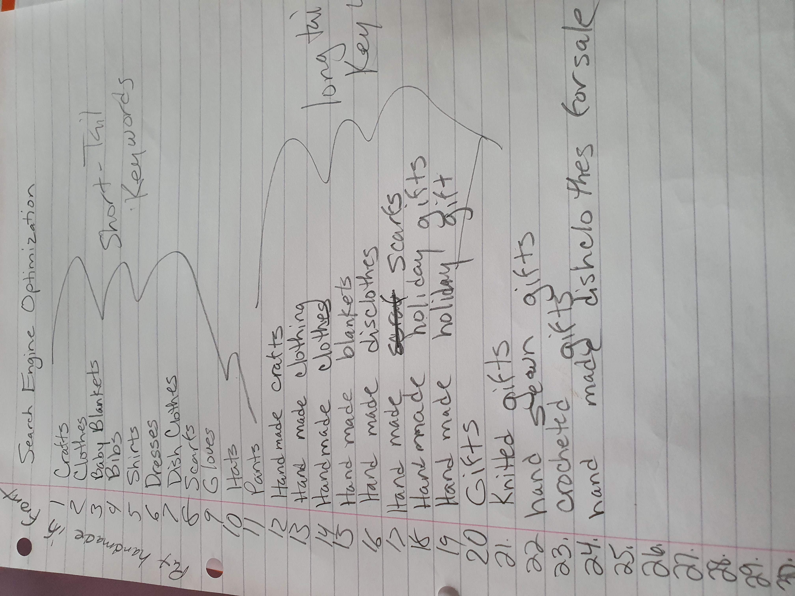

# [Caitlin's Crafts]()

## Marketing Research

- 1. _Who are your users?_
     My users are people who like to give home made gifts to family and friends.
- 2. _Which online platforms would you find lots of your users?_
     Pinterest, Facebook, Instagram, Twitter
- 3. _Would you user use social media?_
     Possibly depending on their age they may use Facebook at least. Younger people may not use Facebook but other platforms may be used to suplement for them.
- 4. _What do your users need?_
    - hand made gifts that are made well.
     _Could you meet the need with useful content?_
     _If yes, how could you best deliver that content?_
    - Yes, I think a newsletter that showcases newer products that are on the website would be the way to go with this. Also, Facebook, Instagram and Twitter could be used to post photos of merchandise that is available.
- 5. _Would your business run sales or offer discounts?_
     When Caitlin sold her dish cloths in the United States she use to do 3 for $5(proce was $3 for one). So this would definitely be a possible idea. 
     _How do you think your users would most like to hear about offers?_
     - These offers could be in a monthly newsletter or internet posts.
- 6. _What are the goals of the business?_
    - To sell hand made crafts to the public at  reasonable price.
     _Which marketing strategies would offer the best ways to meet these goals?_
    - Have a monthly newsletter, use social media to post pictures of items that are available for sale.
- 7. _Would your business have the budget to spend on advertising? Or would  it need to work with free or low cost options to market itself?_
    - Initially the market will need to be free or low cost due to the newness of the business.

## SEO Keywords

### Short Tale keywords
- 1. gifts
- 2. crafts
- 3. clothes
- 4. Baby Blankets
- 5. Blankets
- 6. Bibs
- 7. Shirts
- 8. Dresses
- 9. Dish cloths
- 10. Scarfs
- 11. gloves
- 12. hats
- 13. pants

### Long Tale keywords
- 1. Hand made crafts
- 2. Hand made clothes
- 3. Hand made Baby Blankets
- 4. Hand made Blankets
- 5. Hand made Bibs
- 6. Hand made Shirts
- 7. Hand made Dresses
- 8. Hand made Dish Cloths
- 9. Hand made Scarfs
- 10. Hand made Hats
- 11. Hand made Pants
- 12. Hand made Gifts
- 13. Hand made Gloves
- 14. Hand made clothing
- 15. Hand made holiday gift
- 16. Hand made holiday gifts
- 17. knitted gifts
- 18. hand sewn gifts
- 19. crocheted gifts
- 20. embroidered gifts
- 21. Hand made dish cloths for sale

Return back to [README.md](README.md)
