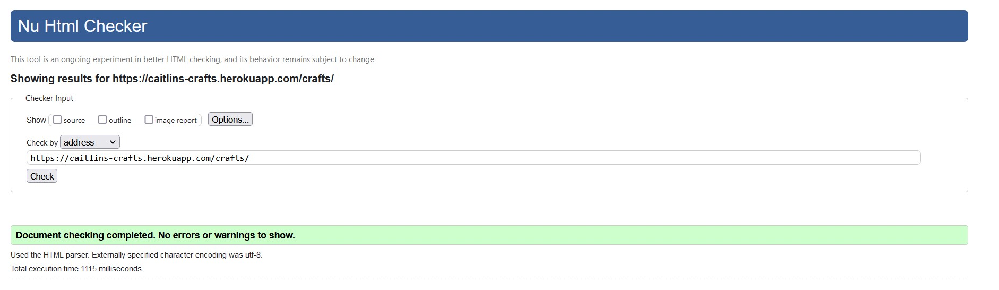
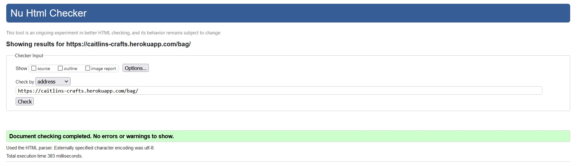
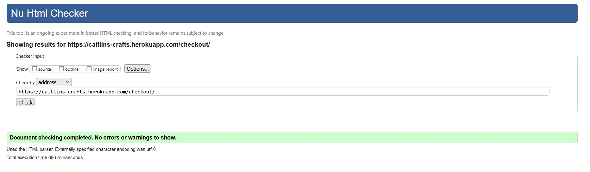
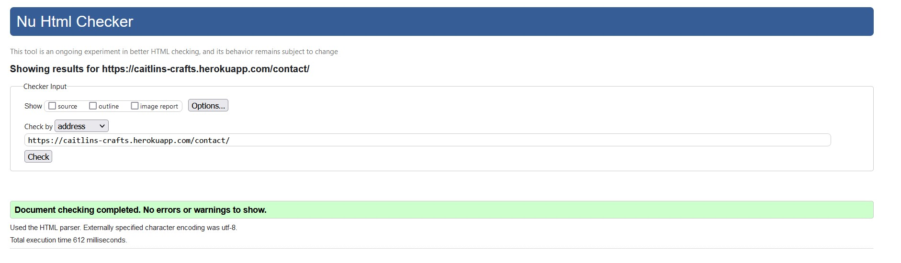
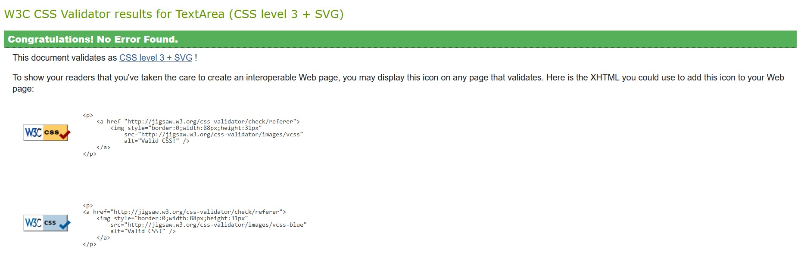
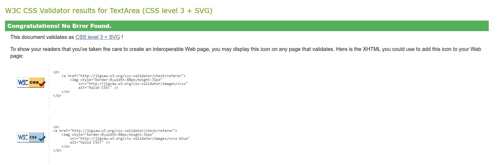

# Testing for Caitlin's Crafts

## Browser Compatability
- Firefox
    - 

- Microsoft Edge
    - 

- Google Chrome
    - 

## Responsiveness
- Desktop
     - 

- Tablet
     - 

- Cell Phone
     - 

## Validator Testing

### HTML Validation
- site testing
     - 
- crafts  testing
     - 
- bag  testing
     - 
- checkout  testing
     - 
- contact testing
     - 
- newsletter
     - 

### CSS Validation
- base.css
     - 
- checkout.css
     - 
- profiles.css
     - 

### 404 Page for Caitlin's Crafts
    - 

### Pep8 Testing
To view all Pep8 testing, go to [PEP.md](PEP.md)

### Bugs and Remaining Bugs
To view all bugs, go to [BUGS.md](BUGS.md)

### User Stories testing:
To view all userstories, go to [USERSTORIES.md](USERSTORIES.md)

Return back to [README.md](README.md)