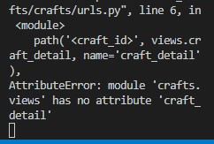

# Testing for Caitlin's Crafts

## User Stories testing:

    
## Browser Compatability
- Firefox
    - 

- Microsoft Edge
    - 

- Google Chrome
    - 

## Responsiveness
- Desktop
     - 

- Tablet
     - 

- Cell Phone
     - 

## Validator Testing

### Pep8
-  Pep8 for models.py
     - 

### HTML Validation
- 

### CSS Validation
- 

## Remaining Bugs
- 

## Bugs
- Needed to add I solve it by removing s from function in crafts/views.py. My function was not called craft_detail instead it was crafts_detail.
     -
- Made crafts be craft where needed in code on crafts.html and craft_detail.html. 
     -
     -

Return back to [README.md](README.md)
